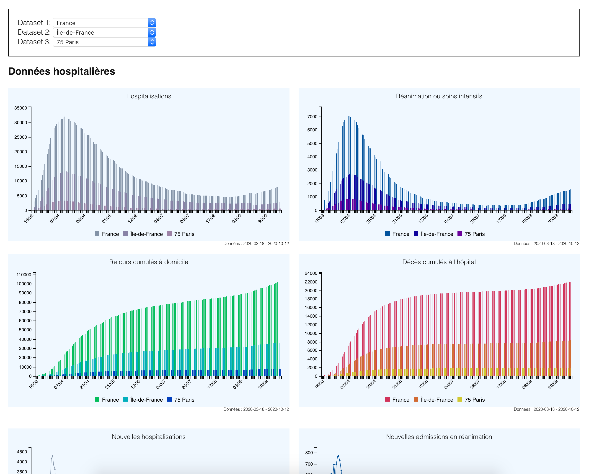

# covid-dashboard-france
PHP 7.1+ / js code to display public covid data in France

Published at: https://gregoriol.github.io/covid-dashboard-france/

# Why
Inspired by: https://dashboard.covid19.data.gouv.fr/vue-d-ensemble?location=FRA
Can be easily updated (the official one is not updated on week-ends) and is more practical on mobile screens.

# Screenshot

# How
Processing code is in php 7.1+. It generates a static html file containing all the necessary data so it can be displayed on a device without a server.

Run `php get.php` to retrieve CSV files from data.gouv.fr.
CSV data files will be stored in the cache folder; run `rm cache/*.csv` to clear it before running get again to get new data.

Run `yarn install` or `npm install` to retrieve modules needed for the frontend (c3 graphs, tinycolor, ...).

# Data
Based on:
* regions: https://www.insee.fr/fr/information/3363419#titre-bloc-23
* covid: https://www.data.gouv.fr/fr/organizations/sante-publique-france/
